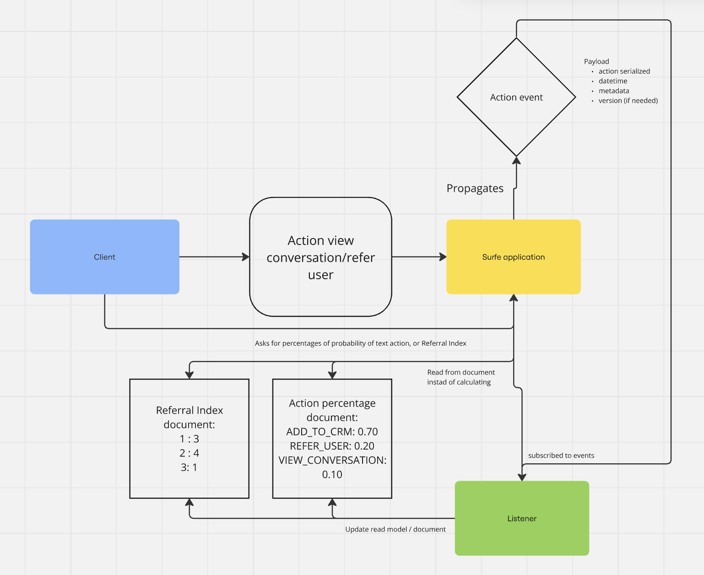

## Additional proposals
The logic of reading the data could be less complex and also we could avoid calculating every time if it's done in the write part, updating the data 
in a document/read model  when the action happens.
## Flow Description:

### User Action Trigger:
A user performs an action, e.g., VIEW_CONVERSATION.
### Event Creation:
The Surfe Service captures this action and generates an event (e.g., UserActionEvent), encapsulating details like the user ID, action type, and timestamp.
### Event Propagation:
The event is published to a message broker (e.g., RabbitMQ, Kafka, or AWS SNS/SQS).
### Subscriber Consumption:
One or more Event Subscribers listen for these events. A specific subscriber, such as ActionProbabilityUpdater, consumes the event.
### Document Update:
The subscriber fetches the current probabilities from the database for the action (e.g., VIEW_CONVERSATION, REFERRAL).
It updates the document to reflect the new probabilities or the referral number based on historical data and saves it back.

